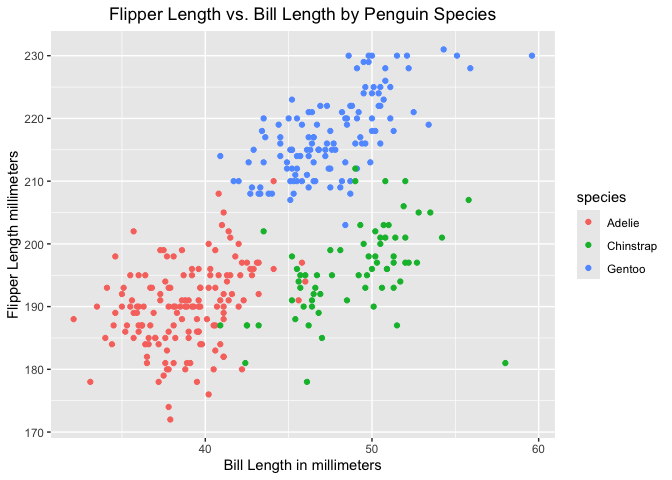

P8105_HW1_SW4257
================

``` r
library(palmerpenguins)
library(ggplot2)
library(tidyverse)
```

## Problem 1

``` r
data("penguins", package = "palmerpenguins")
```

The `penguins` dataset contains measurements for 3 penguin species, and
they are Adelie, Chinstrap, Gentoo. The penguins were observed on
Biscoe, Dream, Torgersen islands. Important variables include `species`,
`island`, `bill length and bill depth in millimeters`,
`flipper length in millimeters`, `body mass in grams`, `sex`, and
`year`. The dataset contains 344 observations and 8 variables. The mean
flipper length is 200.92 mm.

The code and scatterplot below show the relationship between penguins’
bill length and flipper length in millimeters. Different colors
represent the three penguin species. The plot was saved as
`penguins_scatterplot.png`.

``` r
ggplot(data = penguins,
       aes(x = bill_length_mm, 
           y = flipper_length_mm, 
           color = species)) + 
  geom_point(na.rm = TRUE) +
  labs(title = "Flipper Length vs. Bill Length by Penguin Species",
       x = "Bill Length in millimeters",
       y = "Flipper Length millimeters") +
  theme(plot.title = element_text(hjust = 0.5))
```

<!-- -->

``` r
ggsave(filename = "penguins_scatterplot.png")
```

## Problem 2

The data frame comprises:

- a random sample of size 10 from a standard Normal distribution
- a logical vector indicating whether elements of the sample are greater
  than 0
- a character vector of length 10
- a factor vector of length 10, with 3 different factor levels

is created first.

``` r
set.seed(8105)

normal_sample = rnorm(10)

sample_df = data.frame(
  normal_sample = normal_sample,
  greater_than_zero = normal_sample > 0,
  character_vector = letters[1:10],
  factor_vector = factor(
    c("A", "B", "C", "A", "B", "C", "A", "B", "C", "A")
  )
)
```

Then, the mean of each variable in the dataframe was computed as follow:

``` r
mean(pull(sample_df, normal_sample))
```

    ## [1] 0.5520184

``` r
mean(pull(sample_df, greater_than_zero))
```

    ## [1] 0.7

``` r
mean(pull(sample_df, character_vector))
```

    ## Warning in mean.default(pull(sample_df, character_vector)): argument is not
    ## numeric or logical: returning NA

    ## [1] NA

``` r
mean(pull(sample_df, factor_vector))
```

    ## Warning in mean.default(pull(sample_df, factor_vector)): argument is not
    ## numeric or logical: returning NA

    ## [1] NA

We noticed that：

- The mean of the random sample is 0.552.
- The mean of the logical variable is 0.7, indicating that 70% of the
  sampled values are greater than zero.
- The character and factor variables return `NA` because they are
  neither numeric nor logical.

The `as.numeric` function can convert logical, character, and factor
variables to numeric values:

``` r
as.numeric(pull(sample_df, greater_than_zero))
as.numeric(pull(sample_df, character_vector))
as.numeric(pull(sample_df, factor_vector))
```

- Converting the logical variable to numeric produces 1 for TRUE and 0
  for FALSE.
- Converting the character variable produces NA values because its
  letters cannot be converted to numbers.
- Converting the factor variable produces numeric codes for its levels:
  A, B, and C become 1, 2, and 3. This helps explain why the mean works
  for the logical variable but not directly for the character or factor
  variables. Although the converted factor has a numerical mean, that
  mean is not meaningful because the numbers only represent categories.
